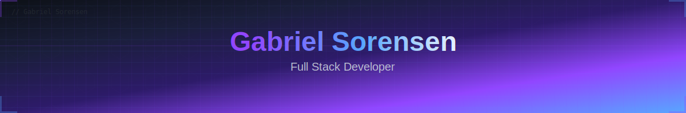

         

  

 
   
🚀 Sobre Mim

const gabriel = {
role: "Full Stack Developer",
focus: "Backend Engineering",
education: {
institution: "Unicamp",
course: "Sistemas de Informação",
status: "Cursando"
},
currentPosition: {
company: "Atria Jr.",
position: "Backend Developer"
},
interests: ["Clean Architecture", "APIs REST", "Data Science", "Cloud Computing"],
learning: ["Microservices", "DevOps", "System Design"],
funFact: "Transformo café em código limpo e escalável ☕→💻"
};

text

💻 Tech Stack

Linguagens

       

Backend & Frameworks

     

Banco de Dados & ORM

    

Frontend

    

Ferramentas & DevOps

      
 
 
🎯 Áreas de Expertise
<table> <tr> <td width="50%" valign="top">
🏗️ Backend Engineering

const backendStack = {
runtime: "Node.js",
language: "TypeScript",
frameworks: ["Express", "Fastify"],
database: "PostgreSQL",
orm: "Prisma",
authentication: "JWT + Refresh Token",
architecture: "Clean Architecture"
}

text

Core Skills:

🔹 Design e desenvolvimento de APIs REST

🔹 Arquitetura em camadas escalável

🔹 Padrões de design (Factory, Repository, DTO)

🔹 Autenticação e autorização segura

🔹 Otimização de queries e performance

</td> <td width="50%" valign="top">
📊 Data Science

data_engineering = {
"manipulation": ["Pandas", "NumPy"],
"visualization": ["Matplotlib", "Seaborn"],
"machine_learning": ["Scikit-learn", "TensorFlow"],
"databases": ["PostgreSQL", "MongoDB"],
"analytics": "Exploratory Data Analysis"
}

text

Competências:

🔹 Manipulação e limpeza de datasets

🔹 Análise exploratória de dados (EDA)

🔹 Modelagem preditiva e ML

🔹 Visualização de dados interativa

🔹 ETL e pipelines de dados

</td> </tr> </table> 
📊 GitHub Statistics

   
 
  
 
  
 
🏆 GitHub Trophies

  
 
🤝 Conecte-se Comigo

📫 Estou sempre aberto a novos projetos, colaborações e oportunidades!

     
   
  
 
  

